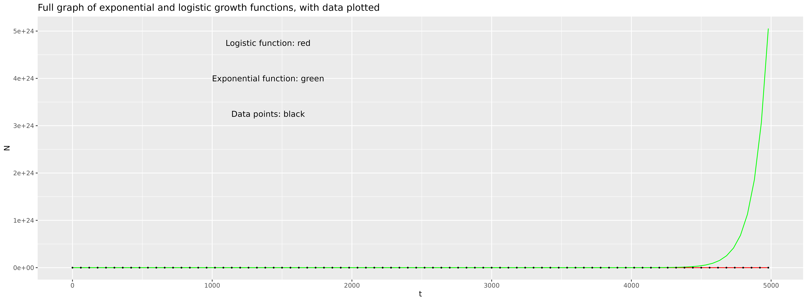
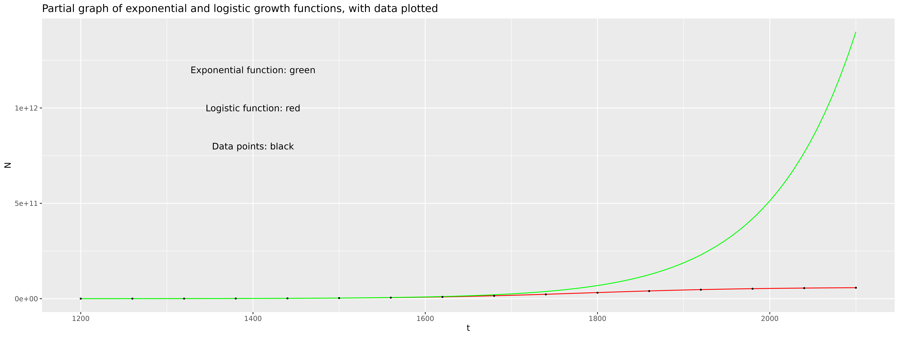

# logistic_growth

This file will describe the contents of this repository, which contains R scripts for a reproducible analysis of logistic growth, based on **dataset 1** from the Github practical from 7/11/23. It was originally forked from files from the repo josegabrielnb/logistic_growth 

Repository contents: 
---
  - 'project.Rproj': contains detail about the settings used by R in this project
  - package-versions.txt': contains list of the packages needed for this analysis
  - 'experiment1.csv': contains dataset from experiment 1; showing the population size (N) at time t; from t=0 to t=4980
  - ' plot_data.R': contains an R script for an initial plot of the data, and for a graph of the log-transformed data
  - 'fit_linear_model.R': contains R script to estimate model parameters (N0, k & r) using 2 linear approximations
  - 'plot_data_and_model.R': contains R script combining model parameters into a function for logistic growth, and plots the data & function
    
Question 1: annotate with more information about analysis
===

Introduction
---

This analysis was carried out to estimate key parameters about a population of *E. Coli* under logistic growth. The parameters of interest were N0 (initial population size), r (intrinsic growth rate), and k (carrying capacity). The data was transformed and plotted, 2 linear models were used to estimate parameters, and then these parameters were fed into a function for logistic growth of the population, which was plotted with the data. 

Analysis scripts in detail
---
- **'plot_data.r'**
  
This file uses ggplot to first plot an untransformed scatterplot of the data, with t on the x axis, and N on the y axis. It then plots a transformed scatterplot, with t on the x axis, and log(N) on the y axis. This second plot has 2 different linear sections to the graph (one where t<1000 and one were t>3000), demonstrating how we can use 2 different linear models to model the graph and find the values of the parameters of interest.

- **'fit_linear_model.r'**

This file generates 2 linear models to fit the data:

1) when t<1000, and K>>N0: the equation can be modelled by N(t) = N0 * exp(rt), or **ln(N) = ln(N0) + rt**

Subset the data so that t<1000, and generate this linear model. The summary from this linear model tells us log(N0) (indicated by the estimate of the intercept), and r (indicated from the estimate of t).

2) when t>3000 and the population number is constant: the equation can be modelled by **N(t) = k**
Subset the data so that t>3000, and generate this linear mode. The summary from the linear model tells us k (indicated by the estimate of the intercept).

- **'plot_data_and_model.r'**
This file creates a logistic function to express N at time t, using the variables N0, r, and k. These variables are defined, using the outputs from the linear models in the previous file. The data is then plotted, with the logistic function added as a line to the graph. The function forms a line through all the data points, demonstrating that the estimates we calculated were correct.

Results
---
The data file used was 'experiment1.csv'. The estimates obtained were:
- N0 = exp(6.883) = 975.55
- r = 0.01004
- k = 6e+10 = 60,000,000,000
  
Question 2: calculate N at t = 4980, assuming exponential growth
===

Equation for exponential growth: N(t) = N0 * exp(r*t)
- at t=4980, r = 0.01004, N0 = exp(6.883):
N(4980) = exp(6.883) * exp(0.01004 * 4980) = exp((6.883)+(0.01004 * 4980)) = 5.054e+24 = 5.054*10^24

**Comparison to logistic model estimate**

The population size at time t=4980 under logistic growth was predicted to be 6e+10 (the estimate for carrying capacity). Under exponential growth, the population size at time t=4980 is predicted to be 5.054e+24 - this is 8.423333e+13 times greater than the population size predicted under logistic growth, and is an unrealistic prediction of the population size. Exponential growth assumes there is no density dependence, and nothing is limiting the growth of the bacteria. However, since the bacteria was being grown in a test tube with a fixed amount of resources (900μl growth media), density dependence would occur: as resources get used up and become scarce, the population growth rate (dN/dt) decreases and slows to 0, and exponential growth no longer occurs (hence logistic growth model is more appropriate for modelling population growth in this scenario). Therefore, the population size estimate at t=4980 given under exponential growth is much much higher than the estimate given under logistic growth.

Question 3: graphically compare exponential and logistic growth
===
I made 2 graphs for this question: 

1) a 'full_graph' showing the exponential function and logistic function, plotted with experimental data, covering the entire range of data from the experiment:
   
    

2) a 'partial_graph' showing the exponential function and logistic function, plotted with experimental data, but covering a smaller range of the data (1200 < t < 2100), so that it is clearer to see the difference between the exponential and logistic function, because in the full_graph figure, the exponential function becomes so much larger than the logistic function that the logistic function appears as a line around y = 0.

 

They demonstrate that the logistic function for growth fits the data well, while the exponential function does not.
